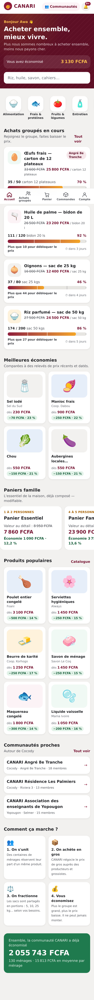
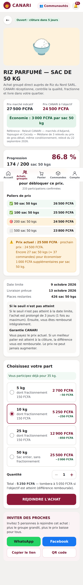
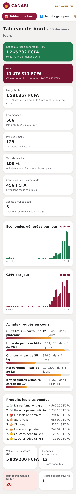
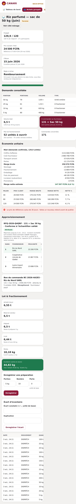

# CANARI — Acheter ensemble, mieux vivre

Centrale d'achat numérique pour les ménages et petits commerces de Côte d'Ivoire.
CANARI agrège la demande de centaines de ménages, achète en gros auprès des
producteurs et grossistes, **fractionne** les volumes (sac de 50 kg → portions de
5, 10, 25 kg) et les distribue en point relais ou à domicile.

```
DEMANDE AGRÉGÉE → ACHAT EN GROS → FRACTIONNEMENT → DISTRIBUTION → ÉCONOMIE POUR LE CLIENT
```

Le KPI principal n'est pas le téléchargement : c'est **l'économie réelle générée
pour les ménages**, mesurée à partir de prix de référence datés et sourcés.

## Démarrage rapide (5 minutes)

Prérequis : Node.js 22+, PostgreSQL 14+.

```bash
npm install
cp .env.example .env                 # puis ajustez DATABASE_URL et les secrets
createdb canari && createdb canari_test   # ou via psql
npm run db:migrate                   # applique le schéma
npm run db:seed                      # données de démo Abidjan (~2 min, 1 100+ commandes)
npm run dev                          # http://localhost:3000
```

### Comptes de démonstration (mot de passe : `canari2026`)

| Rôle | Téléphone | Espace |
|---|---|---|
| Ménage (Awa, Angré) | 07 00 00 00 01 | `/` |
| Super admin | 07 00 00 00 99 | `/admin` |
| Admin opérations (permissions limitées) | 07 00 00 00 98 | `/admin` |
| Fournisseur (Riz du Nord SARL) | 05 00 00 00 01 | `/fournisseur` |
| Livreur | 01 00 00 00 01 | `/livreur` |
| Point relais Angré | 01 00 00 01 01 | `/point-relais` |

Le paiement utilise un **prestataire simulé** : après « Payer », une page de test
permet de simuler un succès ou un échec. Le résultat revient par un webhook signé
HMAC, exactement comme avec un prestataire réel.

## Scripts

| Commande | Rôle |
|---|---|
| `npm run dev` / `build` / `start` | Développement / build de production / serveur |
| `npm run lint` · `npm run typecheck` | ESLint · TypeScript strict |
| `npm test` | Tests unitaires + intégration (PostgreSQL `TEST_DATABASE_URL`) |
| `npm run test:coverage` | Couverture (domaine et services) |
| `npm run test:e2e` | Playwright (après `build` et `db:seed`) |
| `npm run db:seed` | Réinitialise et remplit la base de démo |
| `npm run jobs` | Exécute les tâches planifiées une fois (échéances, remboursements, notifications) |

Avant le premier `npm test`, appliquez le schéma sur la base de test :
`npm run db:test:prepare`.

## Ce que fait le MVP

La boucle complète fonctionne de bout en bout, testée en intégration et en E2E :

1. Inscription d'un ménage (téléphone ivoirien, quartier, composition du foyer, consentements).
2. Achat groupé : progression, paliers de prix, « plus que 27 sacs », règles d'échec affichées **avant** paiement.
3. Choix d'une portion (5 / 10 / 25 / 50 kg), panier, checkout en 4 étapes.
4. Paiement simulé (Mobile Money / carte) via webhook signé et idempotent.
5. Agrégation automatique des quantités → demande consolidée en unités fournisseur, pertes et sachets compris.
6. Clôture : prix final du palier atteint, **différence remboursée automatiquement** (le prix ne peut jamais monter).
7. RFQ aux fournisseurs vérifiés, classement multicritère (jamais sur le seul prix), attribution motivée, bon de commande.
8. Confirmation et expédition par le fournisseur, réception entrepôt (avaries).
9. Fractionnement enregistré lot par lot (préparé, pertes, écarts, reste).
10. Point relais (code/QR de retrait) ou livreur (OTP), incidents.
11. Économies client, marge brute/nette par campagne, tableau de bord admin.

## Documentation

- [Architecture](docs/ARCHITECTURE.md) — couches, décisions, évolution vers mobile et verticales
- [Base de données](docs/DATABASE.md) — modèle, conventions, index
- [API](docs/API.md) — routes REST v1, authentification, erreurs
- [Règles métier](docs/BUSINESS_RULES.md) — paliers, échecs, fractionnement, économies, parrainage
- [Sécurité & confidentialité](docs/SECURITY.md)
- [Déploiement](docs/DEPLOYMENT.md)
- [Audit final](docs/AUDIT.md) — UX, sécurité, performance, logique métier

## Pile technique

Next.js 15 (App Router) · TypeScript strict · Tailwind CSS 4 · PostgreSQL · Prisma 6 ·
zod · Vitest · Playwright. PWA installable (manifeste + service worker « faible connexion »).

## Aperçu

| Accueil | Achat groupé | Back-office | Cockpit d'achat groupé |
|---|---|---|---|
|  |  |  |  |
